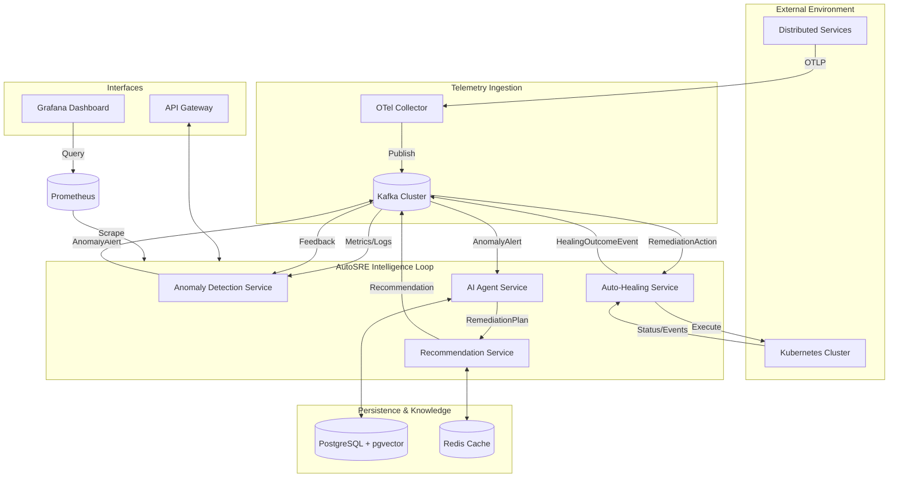

# AutoSRE - Autonomous AI Site Reliability Engineer

[](https://github.com/your-username/autosre/actions)
[](https://opensource.org/licenses/MIT)
[](https://www.oracle.com/java/technologies/javase/jdk21-archive-downloads.html)
[](https://spring.io/projects/spring-boot)

**Status: M7 Complete - Production Ready**

AutoSRE is an autonomous, multi-agent AI platform that monitors distributed systems, detects anomalies in real time, performs AI-driven root cause analysis, and executes auto-healing remediation actions against Kubernetes.

## Architecture



### Services Overview
┌────────────────────────┬──────┬─────────────────────────────────────────────────┐
│ Service                │ Port │ Responsibility                                  │
├────────────────────────┼──────┼─────────────────────────────────────────────────┤
│ anomaly-detection     │ 8081 │ Statistical + ML anomaly detection              │
│ ai-agent              │ 8082 │ LLM-powered RCA + multi-agent orchestration     │
│ recommendation        │ 8083 │ Confidence scoring + approval gate routing      │
│ auto-healing          │ 8084 │ Kubernetes action execution + audit logging      │
│ api-gateway           │ 8080 │ REST API + WebSocket + Swagger UI                │
└────────────────────────┴──────┴─────────────────────────────────────────────────┘
```

## Quick Start

### Prerequisites
- Java 22
- Docker & Docker Compose
- Gradle 8.7+

### 1. Start Infrastructure
```bash
docker compose up -d
```

Verify all containers are healthy:
```bash
docker compose ps
```

### 2. Build All Services
```bash
./gradlew build
```

### 3. Run Tests
```bash
./gradlew test
```

### 4. Run Incident Simulation
```bash
chmod +x scripts/simulate-incident.sh
./scripts/simulate-incident.sh
```

### 5. Access Services

| Service | URL | Description |
|---------|-----|-------------|
| API Gateway | http://localhost:8080 | REST API + Swagger UI |
| Prometheus | http://localhost:9090 | Metrics scrape endpoint |
| Grafana | http://localhost:3000 | Dashboard (admin/admin) |

## Environment Variables

| Variable | Default | Description |
|----------|---------|-------------|
| `AUTOSRE_KAFKA_BOOTSTRAP_SERVERS` | `localhost:9092` | Kafka bootstrap servers |
| `AUTOSRE_DB_HOST` | `localhost` | PostgreSQL host |
| `AUTOSRE_DB_PORT` | `5432` | PostgreSQL port |
| `AUTOSRE_DB_NAME` | `autosre` | PostgreSQL database |
| `AUTOSRE_DB_USER` | `postgres` | PostgreSQL user |
| `AUTOSRE_DB_PASSWORD` | `postgres` | PostgreSQL password |
| `ANTHROPIC_API_KEY` | (empty) | Anthropic API key for LLM |
| `AUTOSRE_K8S_IN_CLUSTER` | `true` | Use in-cluster k8s config |

## API Endpoints

### Incidents
- `GET /api/v1/incidents` - List incidents (paginated)
- `GET /api/v1/incidents/{id}` - Get incident by ID

### Recommendations
- `GET /api/v1/recommendations` - List recommendations
- `GET /api/v1/recommendations/{planId}` - Get recommendation by plan ID

### Approvals
- `POST /api/v1/approvals/{planId}/approve` - Approve a plan
- `POST /api/v1/approvals/{planId}/reject` - Reject a plan

### Audit
- `GET /api/v1/audit` - Query audit log (paginated)

### WebSocket
- `ws://localhost:8080/ws/alerts` - Real-time anomaly stream

## Approval Tiers

| Tier | Condition | Behavior |
|------|-----------|----------|
| AUTO | LOW risk + confidence ≥ 0.90 | Execute immediately |
| ASYNC | MEDIUM risk + confidence ≥ 0.75 | Notify on-call, auto-execute after 5 min |
| SYNC | HIGH risk or confidence < 0.75 | Block until explicit approval |

## Kubernetes Deployment

### Helm Chart
```bash
# Install with Helm
helm install autosre ./helm/autosre \
  --set services.anomaly_detection.enabled=true \
  --set services.ai_agent.enabled=true \
  --set services.recommendation.enabled=true \
  --set services.auto_healing.enabled=true \
  --set services.api_gateway.enabled=true

# Verify deployment
kubectl get pods -l app=autosre

# Check logs
kubectl logs -l app=autosre -f
```

### RBAC
The auto-healing service requires:
- `deployments` get, patch, scale, rollback
- `pods` get, delete, list, watch

ServiceAccount and Role/RoleBinding are created via Helm.

## Development

### Build Specific Service
```bash
./gradlew :services:anomaly-detection-service:build
```

### Run with Custom Config
```bash
AUTOSRE_KAFKA_BOOTSTRAP=my-kafka:9092 ./gradlew bootRun
```

### Add New Agent
1. Create agent class extending `BaseAgent`
2. Add to `AgentOrchestrator`
3. Configure in `AgentContext`
4. Write tests

## Monitoring

### Prometheus Metrics
All services expose metrics at `/actuator/prometheus`:
- `autosre_anomaly_detected_total` - Anomaly detection counter
- `autosre_rca_duration_seconds` - RCA latency histogram
- `autosre_healing_action_total` - Healing action counter
- `autosre_confidence_score` - Recommendation confidence gauge

### Grafana Dashboard
Import `helm/autosre/grafana-dashboard.json` for:
- Kafka consumer lag
- Anomaly detection rate
- RCA latency
- Healing success rate
- Agent confidence scores

## Testing

### Run All Tests
```bash
./gradlew test
```

### Run Service Tests
```bash
./gradlew :services:anomaly-detection-service:test
```

### Integration Tests
Use Testcontainers for integration testing:
```bash
./gradlew :services:ai-agent-service:test --info
```

## Project Structure

```
autosre/
├── PRD.md                    # Project specification
├── README.md                 # This file
├── build.gradle              # Root Gradle build
├── settings.gradle           # Multi-project config
├── docker-compose.yml        # Infrastructure
├── docker-compose.monitoring.yml  # Monitoring stack
│
├── services/
│   ├── anomaly-detection-service/  # M1
│   ├── ai-agent-service/           # M2-M3
│   ├── recommendation-service/      # M4
│   ├── auto-healing-service/       # M5
│   └── api-gateway-service/        # M6
│
├── shared/
│   └── autosre-common/            # Shared models/exceptions
│
├── helm/
│   └── autosre/                   # Helm chart
│
├── scripts/
│   ├── seed-runbooks.py           # RAG embedding script
│   └── simulate-incident.sh       # E2E test script
│
└── infra/
    ├── kafka/                     # Topic configuration
    ├── postgres/                  # Flyway migrations
    └── otel/                      # OpenTelemetry config
```

## License

MIT